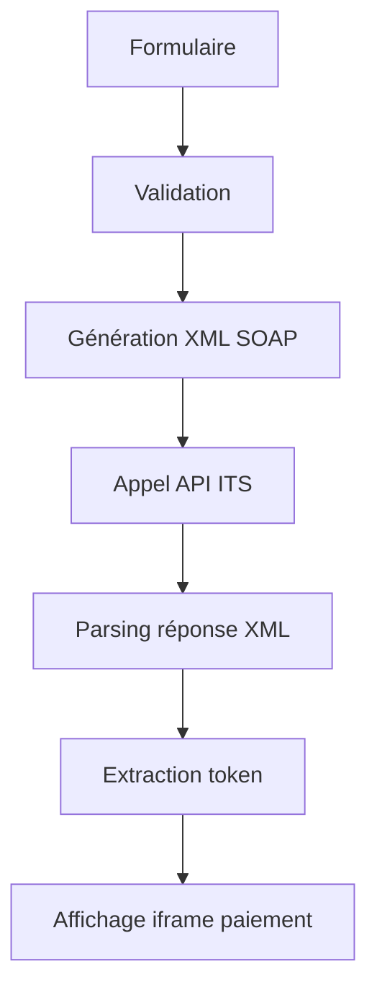

# 🏦 Front-ITS - Interface Vue 3 pour ITS Payment Gateway

Cette application Vue 3 permet de générer des tokens de paiement via l'API ITS et d'afficher l'interface de paiement dans un iframe.

## 🚀 Fonctionnalités

- **Formulaire de génération de token** : Interface utilisateur pour saisir les paramètres de paiement
- **Appel API SOAP** : Communication avec l'API ITS via requêtes SOAP/XML
- **Parsing automatique** : Extraction automatique du token depuis la réponse XML
- **Interface de paiement** : Affichage de l'iframe ITS pour effectuer le paiement
- **Logs de débogage** : Suivi détaillé des opérations pour le développement
- **Gestion d'erreurs** : Gestion complète des erreurs réseau et API

## 📋 Prérequis

- Node.js 16+ 
- npm ou yarn

## 🛠️ Installation

```bash
# Installer les dépendances
npm install

# Ou avec yarn
yarn install
```

## 🏃‍♂️ Lancement

```bash
# Mode développement
npm run dev

# Ou avec yarn
yarn dev
```

L'application sera accessible sur `http://localhost:3000`

## 📦 Build de production

```bash
# Build pour la production
npm run build

# Prévisualiser le build
npm run preview
```

## 🔧 Configuration

### Paramètres par défaut

L'application est préconfigurée avec les valeurs suivantes :

- **Montant** : 12000 (120.00 EUR)
- **Code Pays** : FRA
- **Code Devise** : EUR
- **Contrôle CV2/AVS** : C
- **Langue** : FR
- **Locale** : FR
- **Référence** : TEST-ORDER-006
- **ID Fournisseur** : djust_test

### API ITS

- **URL** : `https://itspgw.its-connect.net/Service.svc`
- **Action SOAP** : `http://tempuri.org/IPaymentGateway/GeneratePaypageToken`
- **URL de paiement** : `https://ecommerce.its-connect.net/PayPage/Token/{SupplierID}/{Token}`

## 🎯 Utilisation

1. **Remplir le formulaire** : Ajustez les paramètres de paiement selon vos besoins
2. **Générer le token** : Cliquez sur "Générer le Token" pour appeler l'API ITS
3. **Visualiser le résultat** : Le token généré s'affiche avec les détails de la transaction
4. **Effectuer le paiement** : Utilisez l'iframe pour procéder au paiement
5. **Nouvelle transaction** : Cliquez sur "Nouvelle Transaction" pour recommencer

## 🔍 Débogage

L'application inclut une section de logs de débogage qui affiche :

- Les données envoyées à l'API
- La réponse XML brute
- Le token extrait
- L'URL de paiement générée
- Les erreurs éventuelles

## 📝 Structure du projet

```
front-its/
├── src/
│   ├── App.vue              # Composant principal
│   ├── main.js              # Point d'entrée
│   └── services/
│       └── itsService.js    # Service pour l'API ITS
├── index.html               # Template HTML
├── package.json             # Dépendances et scripts
├── vite.config.js          # Configuration Vite
└── README.md               # Documentation
```

## 🛡️ Gestion des erreurs

L'application gère plusieurs types d'erreurs :

- **Erreurs de validation** : Vérification des champs requis
- **Erreurs réseau** : Problèmes de connexion à l'API
- **Erreurs HTTP** : Codes d'erreur du serveur (404, 500, etc.)
- **Erreurs de parsing** : Problèmes lors de l'analyse de la réponse XML
- **Timeouts** : Délai d'attente dépassé (30 secondes)

## 🔒 Sécurité et CORS

⚠️ **Important** : Cette application effectue des requêtes cross-origin vers l'API ITS. En cas de problèmes CORS en développement, vous pouvez :

1. Utiliser un proxy de développement
2. Désactiver temporairement CORS dans votre navigateur (développement uniquement)
3. Configurer un serveur proxy côté backend

## 🎨 Personnalisation

### Styles

L'application utilise CSS moderne avec :
- Flexbox et CSS Grid
- Variables CSS pour les couleurs
- Design responsive
- Animations et transitions

### Composants

Le code est structuré de manière modulaire :
- `App.vue` : Interface utilisateur principale
- `itsService.js` : Logique métier et appels API

## 🧪 Test de l'intégration

Pour tester l'intégration :

1. Lancez l'application en mode développement
2. Utilisez les valeurs par défaut ou modifiez-les
3. Vérifiez les logs de débogage pour suivre le processus
4. Testez avec différents montants et références

## 📞 Support

En cas de problème :

1. Vérifiez les logs de débogage dans l'application
2. Consultez la console du navigateur pour les erreurs détaillées
3. Vérifiez la connectivité réseau vers l'API ITS
4. Assurez-vous que les paramètres (SupplierID, etc.) sont corrects

## 🔄 Workflow de paiement



## 📊 Exemple de réponse ITS

```xml
<s:Envelope xmlns:s="http://schemas.xmlsoap.org/soap/envelope/">
    <s:Body>
        <GeneratePaypageTokenResponse xmlns="http://tempuri.org/">
            <GeneratePaypageTokenResult xmlns:a="http://schemas.datacontract.org/2004/07/ITS.PaymentGatewayDataContract">
                <a:Amount>12000</a:Amount>
                <a:CountryCode>FRA</a:CountryCode>
                <a:CurrencyCode>EUR</a:CurrencyCode>
                <a:PageLanguage>FR</a:PageLanguage>
                <a:PageLocale>FR</a:PageLocale>
                <a:Reference>TEST-ORDER-006</a:Reference>
                <a:ResultDescription>Token generated Successfully</a:ResultDescription>
                <a:SupplierID>djust_test</a:SupplierID>
                <a:Token>250825145343281</a:Token>
            </GeneratePaypageTokenResult>
        </GeneratePaypageTokenResponse>
    </s:Body>
</s:Envelope>
```