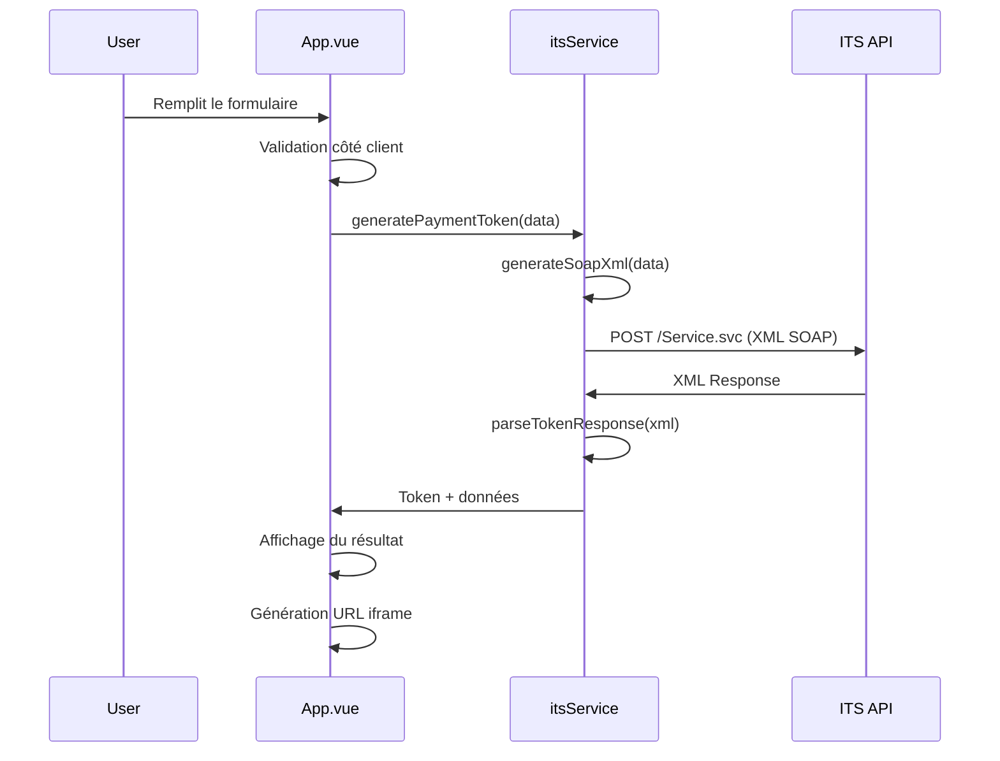

# 🔧 Documentation Technique - Front-ITS

## Architecture

### Vue d'ensemble
```
┌─────────────────┐    ┌─────────────────┐    ┌─────────────────┐
│   Vue 3 App     │───▶│   ITS Service   │───▶│   ITS API       │
│   (Frontend)    │    │   (SOAP/XML)    │    │   (Gateway)     │
└─────────────────┘    └─────────────────┘    └─────────────────┘
         │                       │                       │
         ▼                       ▼                       ▼
┌─────────────────┐    ┌─────────────────┐    ┌─────────────────┐
│   User Form     │    │   XML Parser    │    │   Payment Page  │
│   (Input)       │    │   (Response)    │    │   (iframe)      │
└─────────────────┘    └─────────────────┘    └─────────────────┘
```

### Composants principaux

#### 1. App.vue
- **Rôle** : Composant principal de l'application
- **Responsabilités** :
  - Gestion de l'état de l'application
  - Interface utilisateur du formulaire
  - Affichage des résultats et de l'iframe
  - Gestion des erreurs et logs

#### 2. itsService.js
- **Rôle** : Service de communication avec l'API ITS
- **Responsabilités** :
  - Génération du XML SOAP
  - Appels HTTP vers l'API ITS
  - Parsing des réponses XML
  - Validation des données
  - Gestion des erreurs

## Flux de données

### 1. Génération du token


### 2. Structure des données

#### Données d'entrée (FormData)
```javascript
{
  Amount: 12000,           // Montant en centimes
  CountryCode: "FRA",      // Code pays ISO 3166
  CurrencyCode: "EUR",     // Code devise ISO 4217
  CV2AVSControl: "C",      // Contrôle CV2/AVS (C/A/N)
  PageLanguage: "FR",      // Langue de la page
  PageLocale: "FR",        // Locale de la page
  Reference: "TEST-ORDER-006", // Référence unique
  SupplierID: "djust_test"     // ID fournisseur
}
```

#### Réponse parsée
```javascript
{
  Amount: 12000,
  CountryCode: "FRA",
  CurrencyCode: "EUR",
  PageLanguage: "FR",
  PageLocale: "FR",
  Reference: "TEST-ORDER-006",
  ResultDescription: "Token generated Successfully",
  SupplierID: "djust_test",
  Token: "250825145343281"
}
```

## Protocole SOAP

### Requête XML
```xml
<?xml version="1.0" encoding="utf-8"?>
<x:Envelope xmlns:x="http://schemas.xmlsoap.org/soap/envelope/" 
            xmlns:tem="http://tempuri.org/" 
            xmlns:its="http://schemas.datacontract.org/2004/07/ITS.PaymentGatewayDataContract">
    <x:Body>
        <tem:GeneratePaypageToken>
            <tem:objPaypageRequestResponse>
                <its:Amount>12000</its:Amount>
                <its:CountryCode>FRA</its:CountryCode>
                <its:CurrencyCode>EUR</its:CurrencyCode>
                <its:CV2AVSControl>C</its:CV2AVSControl>
                <its:PageLanguage>FR</its:PageLanguage>
                <its:PageLocale>FR</its:PageLocale>
                <its:Reference>TEST-ORDER-006</its:Reference>
                <its:SupplierID>djust_test</its:SupplierID>
            </tem:objPaypageRequestResponse>
        </tem:GeneratePaypageToken>
    </x:Body>
</x:Envelope>
```

### Headers HTTP requis
```
Content-Type: text/xml; charset=utf-8
SOAPAction: http://tempuri.org/IPaymentGateway/GeneratePaypageToken
```

### Réponse XML
```xml
<s:Envelope xmlns:s="http://schemas.xmlsoap.org/soap/envelope/">
    <s:Body>
        <GeneratePaypageTokenResponse xmlns="http://tempuri.org/">
            <GeneratePaypageTokenResult xmlns:a="http://schemas.datacontract.org/2004/07/ITS.PaymentGatewayDataContract">
                <a:Amount>12000</a:Amount>
                <a:CountryCode>FRA</a:CountryCode>
                <a:CurrencyCode>EUR</a:CurrencyCode>
                <a:PageLanguage>FR</a:PageLanguage>
                <a:PageLocale>FR</a:PageLocale>
                <a:Reference>TEST-ORDER-006</a:Reference>
                <a:ResultDescription>Token generated Successfully</a:ResultDescription>
                <a:SupplierID>djust_test</a:SupplierID>
                <a:Token>250825145343281</a:Token>
            </GeneratePaypageTokenResult>
        </GeneratePaypageTokenResponse>
    </s:Body>
</s:Envelope>
```

## Parsing XML

### Stratégie de parsing
Le parsing utilise `DOMParser` avec plusieurs stratégies de sélection :

1. **Sélecteur avec namespace** : `a\\:${tagName}`
2. **Sélecteur simple** : `${tagName}`
3. **Sélecteur par localName** : `*[localName="${tagName}"]`

### Gestion des namespaces
```javascript
const getElementValue = (tagName) => {
  const selectors = [
    `a\\:${tagName}`,           // Namespace 'a:'
    `${tagName}`,               // Sans namespace
    `*[localName="${tagName}"]` // LocalName générique
  ]
  
  for (const selector of selectors) {
    const element = xmlDoc.querySelector(selector)
    if (element) {
      return element.textContent.trim()
    }
  }
  return null
}
```

## Gestion des erreurs

### Types d'erreurs gérées

#### 1. Erreurs de validation
```javascript
// Validation des champs requis
if (!paymentData.Amount || paymentData.Amount <= 0) {
  errors.push('Le montant doit être supérieur à 0')
}
```

#### 2. Erreurs réseau
```javascript
// Timeout
if (error.code === 'ECONNABORTED') {
  throw new Error('Timeout: Le serveur ITS ne répond pas dans les temps')
}

// Erreurs HTTP
if (error.response) {
  const status = error.response.status
  if (status === 404) {
    throw new Error('Service ITS non trouvé (404)')
  }
}
```

#### 3. Erreurs de parsing
```javascript
// Vérification du parser DOM
const parserError = xmlDoc.querySelector('parsererror')
if (parserError) {
  throw new Error(`Erreur de parsing XML: ${parserError.textContent}`)
}
```

## Configuration CORS

### Problème CORS
Les navigateurs bloquent les requêtes cross-origin vers l'API ITS.

### Solutions

#### 1. Proxy de développement (recommandé)
```javascript
// server.js
app.use('/api/its', createProxyMiddleware({
  target: 'https://itspgw.its-connect.net',
  changeOrigin: true,
  pathRewrite: {
    '^/api/its': '/Service.svc'
  }
}))
```

#### 2. Configuration Vite
```javascript
// vite.config.js
export default defineConfig({
  server: {
    proxy: {
      '/api/its': {
        target: 'https://itspgw.its-connect.net',
        changeOrigin: true,
        rewrite: (path) => path.replace(/^\/api\/its/, '/Service.svc')
      }
    }
  }
})
```

## Performance

### Optimisations

#### 1. Timeout configuré
```javascript
const config = {
  timeout: 30000, // 30 secondes
  // ...
}
```

#### 2. Validation côté client
```javascript
// Validation avant envoi pour éviter les appels inutiles
const validation = validatePaymentData(formData.value)
if (!validation.isValid) {
  // Afficher les erreurs sans appeler l'API
  return
}
```

#### 3. Mise en cache des réponses
```javascript
// Possibilité d'ajouter un cache simple
const tokenCache = new Map()
const cacheKey = JSON.stringify(paymentData)
if (tokenCache.has(cacheKey)) {
  return tokenCache.get(cacheKey)
}
```

## Sécurité

### Considérations

#### 1. Validation des données
- Validation côté client ET serveur
- Échappement des caractères spéciaux dans le XML
- Validation des formats (montant, codes pays, etc.)

#### 2. Gestion des tokens
- Les tokens ne sont pas stockés localement
- Pas de cache persistant des données sensibles
- Logs de débogage désactivables en production

#### 3. HTTPS obligatoire
- Toutes les communications avec l'API ITS en HTTPS
- Iframe de paiement en HTTPS

## Tests

### Tests unitaires possibles

#### 1. Validation des données
```javascript
describe('validatePaymentData', () => {
  it('should validate correct data', () => {
    const result = validatePaymentData(validData)
    expect(result.isValid).toBe(true)
  })
})
```

#### 2. Génération XML
```javascript
describe('generateSoapXml', () => {
  it('should generate valid SOAP XML', () => {
    const xml = generateSoapXml(testData)
    expect(xml).toContain('<its:Amount>12000</its:Amount>')
  })
})
```

#### 3. Parsing XML
```javascript
describe('parseTokenResponse', () => {
  it('should extract token from XML', () => {
    const result = parseTokenResponse(sampleXml)
    expect(result.Token).toBe('250825145343281')
  })
})
```

## Déploiement

### Build de production
```bash
npm run build
```

### Variables d'environnement
```bash
# .env.production
VITE_ITS_API_URL=https://itspgw.its-connect.net/Service.svc
VITE_DEBUG_MODE=false
```

### Serveur statique
```bash
# Après build
npm run preview
```

## Monitoring

### Logs disponibles
- Requêtes SOAP envoyées
- Réponses XML reçues
- Erreurs détaillées
- Temps de réponse
- Tokens générés (sans données sensibles)

### Métriques utiles
- Taux de succès des appels API
- Temps de réponse moyen
- Erreurs par type
- Utilisation par référence de commande